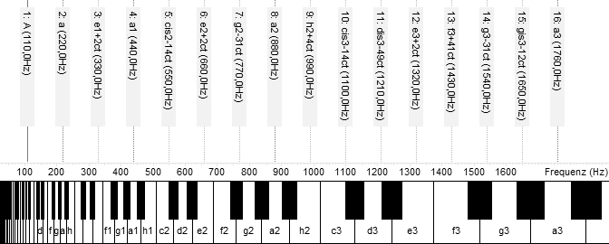

# Einführung {#sec:Einführung}

Markdown ist ein textbasiertes Dokumentformat, mit dem man auf einfache Weise formatierte Textdokumente erstellen kann. Markdown unterstützt Hervorhebungen in *Kursivschrift*, **Fettdruck** und `Schreibmaschinenschrift` (nützlich z.B. für Code-Beispiele), Formeln: $E = mc^2$, und eine ganze Reihe weiterer Textelemente wie z.B. Überschriften, Aufzählungen, Blockzitate und Codeblöcke.

Markdown ist eine Art [Markup]-Format, d.h., die Textelemente werden durch entsprechende "Auszeichnungen" (engl. "Markup") gekennzeichnet. Dabei beschreibt der Markup die *Art* eines Textelements ("was"), ohne die *Formatierung* festzulegen ("wie").^[Markdown ist keine 100%-ige Markup-Sprache, das es auch noch einige Möglichkeiten zur visuellen Formatierung bietet, wie z.B. manuelle Umbrüche. Auch hat es im Gegensatz zu "richtigen" Markup-Sprachen wie z.B. XML eine natürlichere Syntax, die sich weitgehend wie eine Art ASCII-Faksimile des formatierten Textes liest, was die Eingabe vereinfacht.] Das endgültige Layout ist Sache des Formatierers (z.B. Pandoc oder eines der in [@sec:Anzeige] genannten Anzeige-Programme), kann aber je nach Programm mit entsprechenden Vorlagen bzw. Stildateien beeinflusst werden. Vorteile sind die bequeme Eingabe und eine einheitliche Formatierung. Andererseits sind dadurch auch die Möglichkeiten einer "visuellen Formatierung" bewusst stark eingeschränkt.

[Markup]: https://de.wikipedia.org/wiki/Auszeichnungssprache

Die ursprüngliche Beschreibung des Markdown-Formats von John Gruber findet man unter <https://daringfireball.net/projects/markdown/syntax>. Es gibt davon aber etliche Varianten wie z.B. MultiMarkdown und Pandoc Markdown, die erweiterte Formatierungs-Möglichkeiten bieten, z.B. für Tabellen und mathematische Formeln. Weitere Informationen und Links findet man auf der [Markdown-Wikipedia-Seite](https://de.wikipedia.org/wiki/Markdown). Waren Markdown und Pandoc vor ein paar Jahren noch ein Geheimtipp unter Bloggern, Ebook-Autoren und (Natur-)Wissenschaftlern, so sind sie inzwischen auch in vielen anderen Bereichen beliebt und es gibt eine Vielzahl von Tutorien im WWW, z.B.: <http://www.wiwi.uni-bielefeld.de/lehrbereiche/statoekoinf/comet/mtessmer/Beitraege/Dokumente_erstellen_und_konvertieren_mit_pandoc>

# Anzeige und Konvertierung {#sec:Anzeige}

Markdown-Dateien sind gewöhnliche Textdateien im ASCII- bzw. UTF8-Format, die mit einem Texteditor wie z.B. Textedit auf dem Mac oder Notepad unter Windows erstellt werden. Für Spezialisten empfiehlt sich der Texteditor [GNU Emacs][Emacs], mit dem man auch Programme schreiben kann und der über spezielle Unterstützung zum Schreiben von Markdown-Dateien verfügt. Emacs und seine Mac-Variante [Aquamacs] sind Open-Source-Software und kostenfrei. Eine ebenfalls quelloffene und kostenfreie Alternative zu Emacs ist der [Atom]-Editor von Github, der zusätzlich noch über eine formatierte Vorschau von Markdown-Dateien verfügt.

[Emacs]: https://www.gnu.org/software/emacs/
[Aquamacs]: http://aquamacs.org/

Die Textform von Markdown liest sich wie ein ASCII-Faksimile des formatierten Textes, man benötigt also nicht unbedingt ein spezielles Anzeige-Programm. Wenn man aber das Dokument in einer formatierten Ansicht sehen möchte, so gibt es dafür verschiedene Browser-Erweiterungen (für Chrome und Firefox), Programme und Apps, z.B.:

- Github [Atom] (Linux, Mac, Windows)
- [Marked] (Mac)
- [ReText] (Linux, Mac, Windows)
- [Sublime Text] (Linux, Mac, Windows)
- [Draft] (Android) und [Byword] (iOS)

Die meisten dieser Anwendungen sind tatsächlich *Editoren*, mit denen man Markdown-Texte auch erstellen kann. Atom und ReText sind Open-Source-Software und kostenfrei.

[Atom]: https://atom.io/
[Marked]: http://marked2app.com/
[ReText]: https://github.com/retext-project/retext
[Sublime Text]: https://www.sublimetext.com/
[Draft]: https://play.google.com/store/apps/details?id=com.mvilla.draft
[Byword]: https://bywordapp.com/

Außerdem gibt es mit [Pandoc] eine Open-Source-Software (ebenfalls kostenfrei), mit der man Markdown-Dokumente in verschiedene Formate umwandeln kann, insbesondere HTML und PDF (für Letzteres benötigt man auch die wissenschaftliche Textverarbeitungssoftware [LaTeX]). Die Konvertierung in einige andere gängige Formate für Textdokumente (docx, odt) und Ebooks (epub) ist ebenfalls möglich (mit Einschränkungen). Gängige Elemente wie Abbildungen, Tabellen, Fußnoten, Literaturhinweise und Querverweise im Text werden alle unterstützt, so dass es kein Problem ist, mit Markdown auch umfangreiche wissenschaftliche Arbeiten anzufertigen, die mittels entsprechender Vorlagen auch ansprechend formatiert werden können. Folien und Handouts können mit Pandoc ebenfalls aus Markdown-Dateien erstellt werden.^[Der [Atom]-Editor verfügt mit [Markdown Preview Plus] auch über eine verbesserte Markdown-Vorschau, die optional den Pandoc-Dialekt von Markdown unterstützt.]

[Pandoc]: http://pandoc.org
[LaTeX]: https://www.latex-project.org/
[Markdown Preview Plus]: https://atom.io/packages/markdown-preview-plus

# Formeln und Tabellen {#sec:Formeln}

Mittels pandoc können auch Formeln in LaTeX-Syntax dargestellt werden:

$$ f(t) = \sum_{k=0}^\infty a_k \sin(2\pi k\nu_0 t + \phi_k) $$ {#eq:Fourier}

Dies funktioniert ohne weitere Umstände in der PDF-Ausgabe und auch einige Anzeige-Tools wie [Marked] und die Markdown-Vorschau in [Atom] unterstützen dieses Format. Damit die Formeln in der HTML-Ausgabe und in E-Büchern korrekt dargestellt werden, muss eine entsprechende Ausgabe-Option wie z.B. [MathML] oder [MathJax] verwendet werden.

[MathML]: https://www.w3.org/Math/
[MathJax]: https://www.mathjax.org/

Pandoc unterstützt gleich mehrere der in den verschiedenen Markdown-Dialekten gebräuchlichen Eingabemöglichkeiten für Tabellen. Einfache Tabellen, deren Zellen stets nur eine einzelne Zeile und Spalte umspannen, können z.B. bequem als sogenannte "Pipe"- oder Linien-Tabellen erfasst werden, siehe [@tbl:Beispieltabelle]. Dabei kann optional auch eine Überschrift angegeben werden.^[Man beachte, dass die Beschriftung einer Tabelle von Pandoc *über* der Tabelle angebracht wird und nicht darunter wie bei Abbildungen, vgl. [@sec:Abbildungen]. Dafür gibt es gute Gründe, siehe [TeX StackExchange #3243] bzw. [@schlosser_wissenschaftliche_2011, S. 101].]

[TeX StackExchange #3243]: http://tex.stackexchange.com/questions/3243/why-should-a-table-caption-be-placed-above-the-table

| Komponist    | Nationalität | Lebensdaten | Wichtige Werke                 |
|:-------------|:-------------|:------------|:-------------------------------|
| Monteverdi   | Italien      | 1567-1643   | "L'Arianna"-Oper (1623)        |
| J.S. Bach    | Deutschland  | 1685-1750   | "Johannes-Passion" (1724)      |
| Telemann     | Deutschland  | 1681-1767   | "Brockes-Passion" (1716)       |
| A. Scarlatti | Italien      | 1660-1725   | "Rosmene" (1686)               |
| Couperin     | Frankreich   | 1668-1733   | "Les bagatelles" (1717)        |
| D. Scarlatti | Italien      | 1685-1757   | Cembalosonaten                 |
| Händel       | Deutschland  | 1685-1759   | "Wassermusik" (1717)           |
| Vivaldi      | Italien      | 1678-1741   | "Die vier Jahreszeiten" (1725) |

Table: Beispieltabelle {#tbl:Beispieltabelle}

# Abbildungen und Medien {#sec:Abbildungen}

Abbildungen werden wie folgt mit einem Verweis auf die Bilddatei in den laufenden Text eingefügt (vgl. [@fig:logpitch]):

~~~
{#fig:logpitch width=80%}
~~~

{#fig:logpitch width=80%}

Dabei kann die gewünschte Bildgröße entweder *relativ* zu den Seitendimensionen oder *absolut* (in cm, mm, usw.) spezifiziert werden, und der angegebene Bezeichner kann dann zum Verweis im Text benutzt werden. Abbildungen werden in der HTML-Ausgabe normalerweise an der Stelle eingefügt, an der der Link steht. In der PDF-Ausgabe werden daraus aber (je nach verwendeter Dokumentvorlage) "fließende" Abbildungen.

{#fig:lilypond width=100%}

Natürlich können auf diese Weise auch Partituren in den Text eingefügt werden (solange sie auf eine Seite passen), vgl. [@fig:lilypond]. Dazu muss die Partitur zunächst in ein grafisches Vektor- oder Bitmap-Format konvertiert werden. Wenn man zur Noteneingabe [Lilypond] verwendet, können diese Grafiken per Makefile automatisch aus den Lilypond-Partituren erzeugt werden.

[Lilypond]: http://lilypond.org/

Wie man in den Beispiel-Abbildungen sieht, fügt Pandoc normalerweise automatisch eine Bildunterschrift mit dem angegebenen Text ein. Dies lässt sich vermeiden, wenn man ein unsichtbares Leerzeichen anfügt:

~~~
{width=50%}\
~~~

{width=50%}\

Wenn alle Stricke reißen, kann man auch direkt HTML- bzw. LaTeX-Code eingeben, um die gewünschte Formatierung zu erreichen:

\begin{center}\includegraphics[width=0.5\textwidth]{Noten.png}\end{center}

Auch die Einbettung von Mediendateien (Sound, Video) ist möglich. Diese können entweder per Link oder im HTML-Format auch direkt per HTML-Code in den Text eingefügt werden, z.B.:

[ABC TV: "What The Future Sounded Like" (2006)](https://www.youtube.com/watch?v=8KkW8Ul7Q1I)

<video width="480" height="320" controls="true">
  <source src="future.mp4" type="video/mp4"/>
</video>

# Fußnoten und Querverweise {#sec:Fußnoten}

Fußnoten können entweder "inline"^[d.h. im laufenden Text] gesetzt werden oder per Querverweis.[^FN1] Querverweise auf Kapitel und Abschnitte sind ebenfalls möglich, z.B.: siehe Abschnitt [Einführung]. Der Verweis erfolgt in diesem Fall entweder (wie hier) über die Kapitelüberschrift oder einen explizit in der Überschrift angegebenen Bezeichner. Im Dokument erscheint an der Stelle ein klickbarer Link.

[^FN1]: In diesem Fall kann eine Fußnote auch mehrere Absätze umfassen.

    Die folgenden Absätze müssen dann wie in Markdown üblich um vier Leerzeichen eingerückt werden. Zur Bezeichnung der Fußnote kann wie bei Internet-Links ein beliebiger Bezeichner verwendet werden, die Nummerierung erfolgt automatisch.

Eine alternative Methode, deren Ausgabe eher den akademischen Gepflogenheiten entspricht, bietet das Filterprogramm `pandoc-crossref`.^[Ein Pandoc-*Filter* ist ein spezielles Zusatzprogramm, dass von Pandoc als ein Präprozessor für das zu verarbeitende Markdown-Dokument aufgerufen wird.] Dieses Programm arbeitet ähnlich zu `pandoc-citeproc` (siehe [@sec:Literaturangaben]) und erlaubt Querverweise auf Abschnitte, Abbildungen, Tabellen, Gleichungen und Code-Beispiele über explizit angegebene Bezeichner wie z.B. `sec:Literaturangaben`.^[Man beachte: Werden `pandoc-crossref` und `pandoc-citeproc` beide bei der Formatierung eines Dokuments verwendet, so muss stets `pandoc-crossref` *vor* `pandoc-citeproc` aufgerufen werden.] Dazu muss am Ende des zu referenzierenden Elements (Überschrift, Abbildung, usw.) der Bezeichner angegeben werden, z.B.:

~~~
# Literaturangaben {#sec:Literaturangaben}
{#fig:lilypond}
~~~

Im laufenden Text wird dann mit `[@sec:Literaturangaben]`, `[@fig:lilypond]` usw. auf das jeweilige Element verwiesen. Zu jeder Elementart gehört ein bestimmtes Präfix für den Bezeichner, z.B. `sec:` für Kapitel und Abschnitte, `fig:` für Abbildungen, `eq:` für Gleichungen, usw., denen im ausgegebenen Dokument eine Text-Präfix wie z.B. `Abschnitt`, `Abb.`, `Gleichung` zusammen mit der jeweiligen Nummer entspricht.^[Bei der hier verwendeten `pandoc-crossref`-Version 0.2 sind die Text-Präfixe per Default immer in englischer Sprache, sie lassen sich aber mit entsprechenden Eintragungen im YAML-Header oder durch Einbinden einer sprachspezifischen YAML-Datei leicht anpassen.]

Die beiden Typen von Querverweisen lassen sich auch kombinieren, z.B.: siehe [@fig:lilypond] [Notenbeispiel](#fig:lilypond).

# Literaturangaben {#sec:Literaturangaben}

Für die automatische Literaturverwaltung gibt es das Filter-Programm `pandoc-citeproc`, das Bibliographie-Daten in unterschiedlichen Formaten wie z.B. [BibTeX] verarbeiten kann [@hasecke_zen_2015; @kofler_markdown_2013]. Das Zitieren geschieht einfach durch Angabe des entsprechenden Schlüssels aus der BibTeX-Datei, z.B.: `[@orlarey_dsp_2006]` [@orlarey_dsp_2006]. Dabei können auch verschiedene Zusätze vor und nach dem Zitierschlüssel angegeben werden [siehe @orlarey_dsp_2006, S. 694]. Der Rest funktioniert automatisch; `pandoc-citeproc` extrahiert die zitierten Einträge aus der BibTeX-Datei und fügt die daraus konstruierte Bibliographie an das Ende des Dokuments an.^[Literaturstellen, die in der Bibliographie erscheinen sollen, ohne dass sie explizit zitiert werden, kann man mit dem Schlüssel `nocite` im YAML-Header angeben.]

BibTeX-Dateien kann man mit einem Texteditor direkt eingeben (z.B. bietet [Emacs] auch für [BibTeX] spezielle Unterstützung). Es ist aber meistens wesentlich bequemer, die Einträge online z.B. mit [Zotero] zu erfassen und dann im BibTeX-Format zu exportieren [@pope_how_2014]. Zotero kann einzelne Literaturangaben bis hin zu kompletten Literaturdatenbanken in verschiedenen gängigen Formaten (inkl. BibTeX) importieren und auch bibliographische Informationen von Websites wie Amazon, O'Reilly usw. "saugen". Für Musikwissenschaftler sind insbesondere [BMS] (Bibliographie des Musikschrifttums) und [RISM] (Répertoire International des Sources Musicales) interessant. Beide können bibliographische Angaben in Reuters' EndNote-Format ausgeben, das von Zotero unterstützt wird. Eine weitere nützliche Quelle für wissenschaftliche Publikationen aller Art ist [Google Scholar].

[BibTeX]: http://www.bibtex.org/de/
[Zotero]: https://www.zotero.org
[BMS]: http://www.musikbibliographie.de/
[RISM]: http://de.rism.info/
[Google Scholar]: https://scholar.google.de/

Die tatsächliche Formatierung der Literaturangaben geschieht mittels eines Zitierstils im [CSL]-Format ("Citation Style Language"). Für dieses Dokument wurde zur Illustration ein Zitierstil nach dem [Chicago Manual of Style] verwendet. Der Zitierstil bestimmt sowohl die Formatierung der eigentlichen Bibliographie als auch, ob die Literaturangaben direkt im Text oder in Fußnoten erscheinen, ob identische Angaben mit "ebd." abgekürzt werden, usw. Im [Zotero Style Repository] findet man Tausende von CSL-Dateien für alle möglichen Fachzeitschriften, Institute, Verlage usw., und natürlich kann man diese auch ändern und an die eigenen Bedürfnisse anpassen. Es handelt sich dabei wieder um einfache Textdateien im XML-Format, die mit jedem Texteditor bearbeitet werden können.

[CSL]: http://citationstyles.org/
[Chicago Manual of Style]: http://www.chicagomanualofstyle.org/
[Zotero Style Repository]: https://www.zotero.org/styles 

# Fazit

Markdown und Pandoc sind nicht für alle Publikationen geeignet. Insbesondere Materialien wie z.B. Werbebroschüren, Flyer und Plakate, die umfangreiche visuelle Formatierungen erfordern, fertigt man besser mit einem [WYSIWYG]-Programm an. Für "normale" Texte benötigt man hingegen selten mehr als fortlaufenden Text, mathematische Formeln, Abbildungen, Tabellen, Fußnoten, Querverweise und Literaturangaben, die von Pandoc allesamt unterstützt werden, so dass auch die Erstellung anspruchsvoller wissenschaftlicher Arbeiten bis hin zu kompletten Büchern, Dissertationen, usw. damit möglich ist.

[WYSIWYG]: https://de.wikipedia.org/wiki/WYSIWYG

Auch für musikwissenschaftliche Arbeiten ist Pandoc bestens geeignet, da man Partiturauszüge als Abbildungen problemlos einbinden kann. Für E-Bücher und Folien-Präsentationen im HTML-Format ist eine interessante Möglichkeit das direkte Einbetten von Mediendateien mit Klangbeispielen und Videos.

Die besonderen Vorteile von Markdown und Pandoc liegen zum einen in dem intuitiven Textformat, das die Eingabe vereinfacht und problemlos archiviert und in Versionskontrollsystemen wie z.B. [Git] gespeichert werden kann, zum anderen in der Vielzahl von gebräuchlichen Zielformaten sowohl für den Druck als auch für E-Bücher, Web-Anwendungen und Bildschirmpräsentationen, in die ein Markdown-Dokument mit Pandoc umgewandelt werden kann.

[Git]: https://de.wikipedia.org/wiki/Git

Darüber hinaus gibt es jederzeit die Möglichkeit, Pandoc mittels so genannter Filterprogramme zu erweitern. Mit `pandoc-crossref` und `pandoc-citeproc` hatten wir zwei solche Programme zur Behandlung von Querverweisen und Literaturangaben kennengelernt, die in keiner Pandoc-Installation fehlen sollten. Für die Sozialwissenschaften ist die Integration mit der Programmiersprache [R] für statistische Anwendungen interessant [@gandrud_reproducible_2015; @xie_dynamic_2015]. Natürlich kann man Pandoc-Filter auch selbst programmieren und auf diese Weise Pandoc an die eigenen Vorlieben anpassen; dafür benötigt man allerdings Programmierkenntnisse.

[R]: https://www.r-project.org/

\addcontentsline{toc}{section}{Abbildungsverzeichnis}\LOF

\addcontentsline{toc}{section}{Tabellenverzeichnis}\LOT

# Literaturverzeichnis
